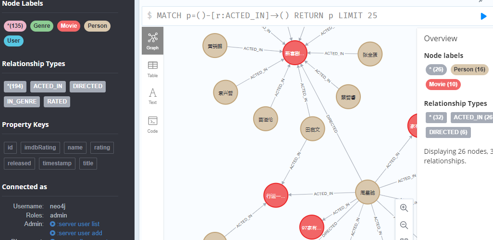
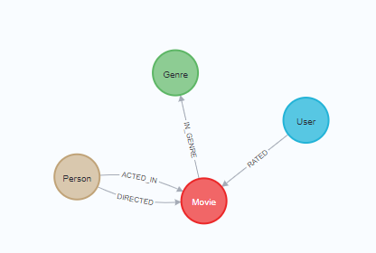
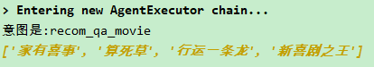
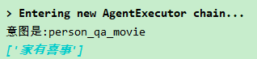

# movie_llm_agent
本项目利用chatglm6b实现一个中文版的简单电影问答功能，目的是探索llm agent与图数据库neo4j进行交互的能力，主要根据用户的意图与neo4j进行交互。

This project uses chatglm6b to implement a simple movie question-and-answer function in Chinese, aiming to explore the ability of llm agent to interact with graph database neo4j,
allowing it to interact with the graph database based on the user's intent.

## Tools
The agent utilizes several tools to interact with the Neo4j graph database effectively:

1. **Person_Tool**:
   - Retrieves movies based on person(actor).
2. **Genre_Tool**:
   - Retrieves movies based on genre.

## chatglm server
You need to deploy a chatglm service, see chatglm_server/chatglm_flask_server.py

## neo4j server
You need to deploy a neo4j service and insert data, see insert_data_to_neo4j.py.

 

 
## data
For simplicity, I've processed and used only a small amount of movie data here, see data/.

## test
我想看剧情类的电影

 

李丽珍参演的电影

 

